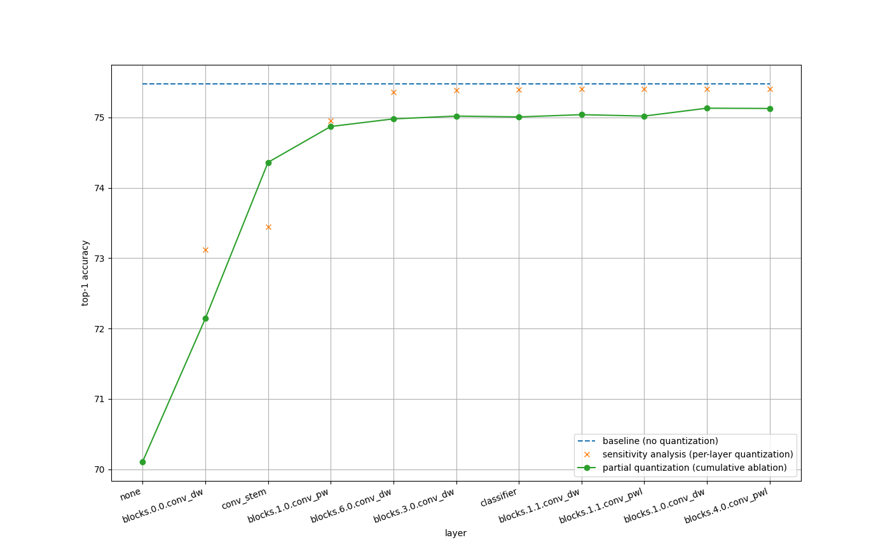

## Setup

### Prepare ImageNet dataset

Download ImageNet dataset under `$HOME/data/imagenet`.

```
$ tree $HOME/data/imagenet -L 1

/home/motoki_kimura/data/imagenet
├── test
├── train
└── val
```

You may use [kaggle /imagenet-object-localization-challenge dataset](https://www.kaggle.com/competitions/imagenet-object-localization-challenge/data)
to download ImageNet dataset.

`test` set is not used in this repository. Use [scripts/valprep.sh](scripts/valprep.sh) if you need to preprocess `val` set.

### Prepare Docker container

```
$ docker compose run --rm dev bash
```

## Usage

### Evaluate float models

Evaluate float model with CUDA:

```
$ python tools/validate.py /work/data/ --model efficientnet_lite0

 * Acc@1 75.480 (24.520) Acc@5 92.518 (7.482)
```

Evaluate float model with CPU:

```
$ python tools/validate.py /work/data/ --model efficientnet_lite0 --force-cpu

 * Acc@1 75.472 (24.528) Acc@5 92.520 (7.480)
```

### Evaluate quantized models

Prepare caliblation data:

```
$ python tools/prep_calib.py /work/data/
```

Evaluate quantized model with CPU:

```
$ python tools/validate.py /work/data/ --model efficientnet_lite0 --quant

 * Acc@1 70.108 (29.892) Acc@5 89.432 (10.568)
```

Note that quantized model runs in CPU mode because Pytorch quantization does not support CUDA inference.

### Sensitivity analysis

```
python tools/validate.py /work/data/ --model efficientnet_lite0 -sa sensitivity_analysis_targets/efficientnet_lite0.json
```

See `sensitivity_analysis_efficientnet_lite0.csv` for the result.

### Partial quantization

```
python tools/validate.py /work/data/ --model efficientnet_lite0 -pq sensitivity_analysis_efficientnet_lite0.csv
```

See `partial_quantization_efficientnet_lite0.csv` for the result.

### Plot result of sensitivity analysis and partial quantization

```
python tools/plot_result.py -sa sensitivity_analysis_efficientnet_lite0.csv -pq partial_quantization_efficientnet_lite0.csv -ba 75.480
```


