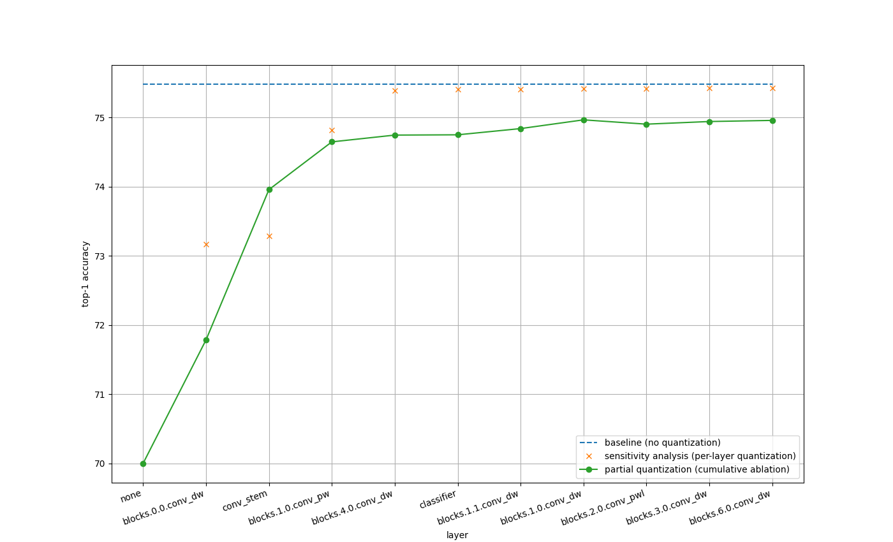

## Setup

### Prepare ImageNet dataset

Download ImageNet dataset under `$HOME/data/imagenet`.

```
$ tree $HOME/data/imagenet -L 1

/home/motoki_kimura/data/imagenet
├── test
├── train
└── val
```

You may use [kaggle /imagenet-object-localization-challenge dataset](https://www.kaggle.com/competitions/imagenet-object-localization-challenge/data)
to download ImageNet dataset.

`test` set is not used in this repository. Use [scripts/valprep.sh](scripts/valprep.sh) if you need to preprocess `val` set.

### Prepare Docker container

```
$ docker compose run --rm dev bash
```

## Usage

### Evaluate float models

Evaluate float model with CUDA:

```
$ python tools/validate.py /work/data/ --model efficientnet_lite0

 * Acc@1 75.482 (24.518) Acc@5 92.520 (7.480)
```

Evaluate float model with CPU:

```
$ python tools/validate.py /work/data/ --model efficientnet_lite0 --force-cpu

 * Acc@1 75.472 (24.528) Acc@5 92.520 (7.480)
```

### Evaluate quantized models

Prepare caliblation data:

```
$ python tools/prep_calib.py /work/data/
```

Evaluate quantized model with CPU:

```
$ python tools/validate.py /work/data/ --model efficientnet_lite0 --quant

 * Acc@1 70.000 (30.000) Acc@5 89.282 (10.718)
```

Note that quantized model runs in CPU mode because Pytorch quantization does not support CUDA inference.

### Sensitivity analysis

```
python tools/validate.py /work/data/ --model efficientnet_lite0 -sa examples/efficientnet_lite0/target_layers.json
```

Result is saved as `result_sensitivity_analysis.csv`.
See [examples/efficientnet_lite0/result_sensitivity_analysis.csv](examples/efficientnet_lite0/result_sensitivity_analysis.csv) for an example.

### Partial quantization

```
python tools/validate.py /work/data/ --model efficientnet_lite0 -pq result_sensitivity_analysis.csv
```

Result is saved as `result_partial_quantization.csv`.
See [examples/efficientnet_lite0/result_partial_quantization.csv](examples/efficientnet_lite0/result_partial_quantization.csv) for an example.

Note that the metrics (top-1, top1_err, top-5, etc.) in `result_partial_quantization.csv` are by cumulative ablation.
If CSV looks like below, you'll get top1=74.646 when **all** of 'blocks.0.0.conv_dw', 'blocks.0.0.act1', 'conv_stem', 'act1', 'blocks.1.0.conv_pw', and 'blocks.1.0.act1' layers are excludede from quantization.

```csv
top1,top1_err,top5,top5_err,param_count,img_size,cropt_pct,interpolation,layers_not_quantized
70.0,30.0,89.282,10.718,4.65,224,0.875,bicubic,[]
71.784,28.216,90.426,9.574,4.65,224,0.875,bicubic,"['blocks.0.0.conv_dw', 'blocks.0.0.act1']"
73.956,26.044,91.572,8.428,4.65,224,0.875,bicubic,"['conv_stem', 'act1']"
74.646,25.354,92.154,7.846,4.65,224,0.875,bicubic,"['blocks.1.0.conv_pw', 'blocks.1.0.act1']"
.
.
.
```

To reproduce top1=74.646:

```
python tools/validate.py /work/data/ --model efficientnet_lite0 --quant --layers-not-quantized 'blocks.0.0.conv_dw' 'blocks.0.0.act1' 'conv_stem' 'act1' 'blocks.1.0.conv_pw' 'blocks.1.0.act1'
```

### Plot result of sensitivity analysis and partial quantization

```
python tools/plot_result.py -sa result_sensitivity_analysis.csv -pq result_partial_quantization.csv -ba 75.482
```


